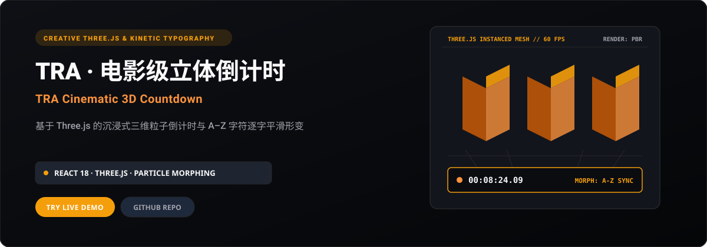
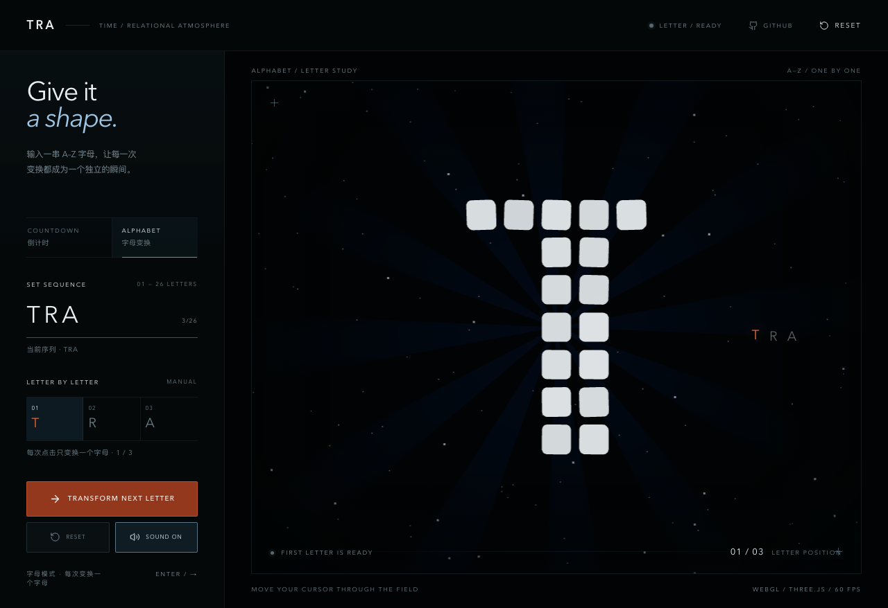

<p align="right">
  <a href="./README.md">简体中文</a> · <strong>English</strong>
</p>

<p align="center">
  
</p>

<p align="center">
  <a href="https://hotpot-timer.xiaosang.cc/"><strong>🌐 Live Demo (Primary)</strong></a> · 
  <a href="https://holynova.github.io/hotpot-timer/"><strong>🚀 Mirror (GitHub Pages)</strong></a> · 
  <a href="https://github.com/holynova/hotpot-timer"><strong>📦 GitHub Source</strong></a> · 
  <a href="https://xiaosang.cc/"><strong>✨ Portfolio</strong></a>
</p>

---

## Proof of Work

<p align="center">
  
</p>

---

## What It Is

A cinematic 3D countdown tool built with React 18 + TypeScript + Three.js. Digits are composed of hundreds of rounded micro-solids and dynamic particle emitters. Beyond precision countdown timing, it allows entering arbitrary A–Z English character sequences with real-time particle disassembly and smooth topological reassembly.

---

## Why It Matters (Key Features)

- **3D Particle Topological Morphing**: SDF-guided point-cloud and cube mesh sampling delivering seamless character-to-character transformations.
- **Cinematic PBR & Post-Processing Bloom**: Multi-source IBL environment maps, metallic PBR shaders, and full-screen bloom passes.
- **Arbitrary Character Morphing**: Dynamically morph from countdown timers into custom entered A–Z words for stage and presentation use.
- **60 FPS InstancedMesh Optimization**: GPU instancing ensuring smooth 60 FPS performance across modern laptops and mobile browsers.

---

## Inventory & Scope

3D countdown mode, arbitrary A-Z character morphing, orbital camera control, immersive full-screen presentation mode.

---

## Quick Start

### 1. Live Demos
Experience it directly in your browser without any setup:
- 🌐 **Primary Demo**: [https://hotpot-timer.xiaosang.cc/](https://hotpot-timer.xiaosang.cc/)
- 🚀 **Alternative Mirror (GitHub Pages)**: [https://holynova.github.io/hotpot-timer/](https://holynova.github.io/hotpot-timer/)

### 2. Local Development
Clone the repository and launch locally:

```bash
git clone https://github.com/holynova/hotpot-timer.git
cd hotpot-timer
pnpm install && pnpm dev
```

---

## License & Author

- **Author**: [holynova (Xiaosang)](https://xiaosang.cc/)
- **License**: [MIT License](./LICENSE)
- **Featured Collection**: Curated as part of [Where Craft Lives (xiaosang.cc)](https://xiaosang.cc/).
